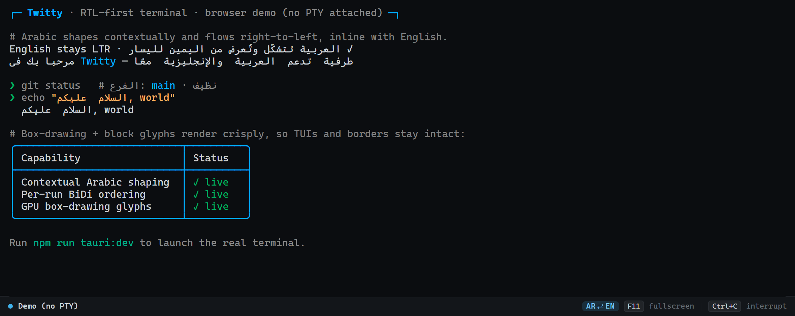
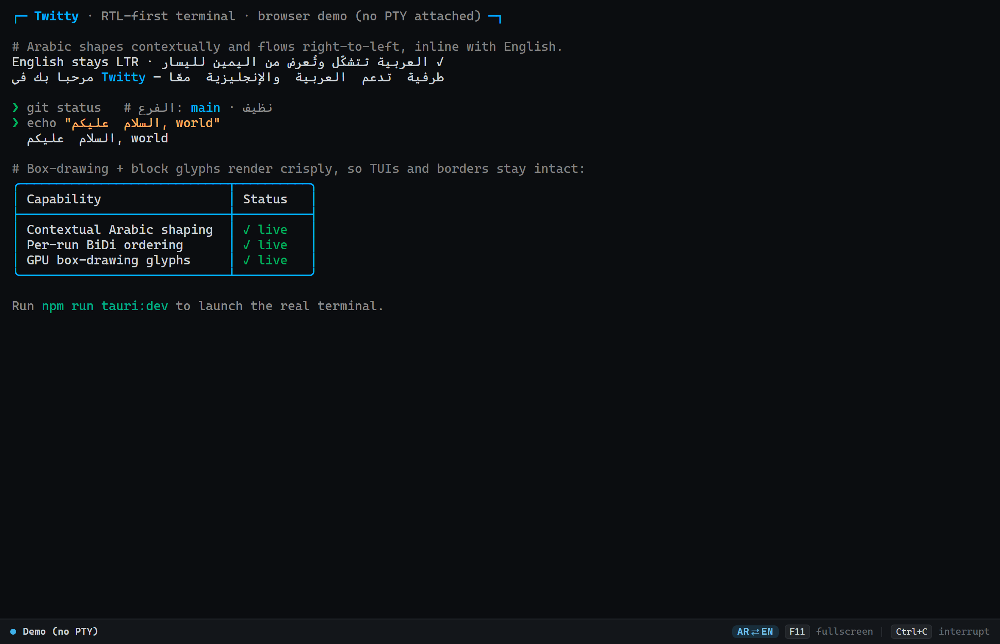
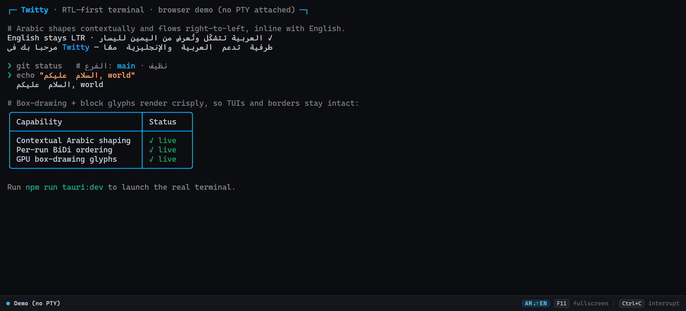

<div align="center">

# Twitty · RTL Terminal

**A bidirectional terminal emulator that renders Arabic the way it's meant to be read.**

Mixed Arabic/English text shapes contextually and flows right-to-left — inline and in real shells — with guarded PTY/session handling for stable day-to-day terminal use.

[](https://github.com/omarallsharkawy/RTL-Terminal/actions/workflows/build.yml)
&nbsp;·&nbsp; Tauri v2 &nbsp;·&nbsp; React 19 &nbsp;·&nbsp; xterm.js 6 &nbsp;·&nbsp; Rust



</div>

---

## Why Twitty

Most terminals treat Arabic as a stream of disconnected, left-to-right code points. Letters don't join, words read backwards, and anything bidirectional turns into noise. Twitty fixes that by pre-shaping printable Arabic runs before xterm.js renders them: Arabic is **contextually shaped** (letters take their correct initial/medial/final/isolated forms and join), each Arabic run is **ordered right-to-left**, and Latin text, numbers, ANSI styling, and box-drawing stay where they belong.

The app also hardens the PTY bridge around real terminal behavior: backend reads preserve split UTF-8 sequences, frontend listeners are cleaned up safely, and session IDs prevent stale shell events from respawning or writing into the wrong terminal instance.

## Features

- **Contextual Arabic shaping** — initial / medial / final / isolated presentation forms with correct joining.
- **Per-run bidirectional ordering** — Arabic flows right-to-left; English, digits, and symbols stay left-to-right, mixed on the same line.
- **Terminal-safe shaping** — printable Arabic runs are shaped while ANSI/control sequences are preserved.
- **Session-hardened PTY bridge** — split UTF-8 reads, stale shell events, and React StrictMode cleanup are handled defensively.
- **Real shell, real PTY** — a genuine pseudo-terminal via Rust `portable-pty` (Windows ConPTY and Unix PTY).
- **Full ANSI support** — 24-bit color, alternate screen, scroll regions, mouse reporting, 10k-line scrollback.
- **Bundled Arabic font** — Noto Naskh Arabic ships with the app so presentation forms render on every OS, including Linux.
- **F11 fullscreen**, native **Ctrl+C** interrupt, auto-resize, and shell auto-respawn on exit.
- **Live status bar** — connection state, active shell, and an AR⇄EN capability indicator.
- **Browser demo mode** — open without a PTY to preview the rendering (the screenshots above are this mode).
- **Cross-platform builds** — Windows installer + Linux `.deb` / `.rpm` / AppImage from one GitHub Actions workflow.

## Screenshots

| Mixed Arabic + English, shaped and ordered | Crisp box-drawing for TUIs |
| --- | --- |
|  |  |

> The Arabic phrase `مرحبا بك في Twitty` reads right-to-left while `Twitty` stays left-to-right; the comma in `السلام عليكم, world` lands between the two scripts correctly.

## Quick start

### Browser demo (no shell)

```bash
npm install
npm run dev
```

Open the printed `localhost` URL. There's no PTY in the browser, so this shows a demo banner — useful for previewing the Arabic rendering.

### Desktop app (real shell)

Install [Rust](https://rustup.rs/) first, then:

```bash
npm install
npm run tauri:dev
```

On Windows the backend uses `TWITTY_SHELL` when set, then falls back through `pwsh.exe -NoLogo -NoProfile`, `powershell.exe -NoLogo -NoProfile`, `%COMSPEC%`, and `cmd.exe`. On Unix it uses `$SHELL`, falling back to `/bin/zsh` on macOS and `/bin/bash` or `/bin/sh` elsewhere.

### Production build

```bash
npm run build         # type-check + bundle the frontend
npm run tauri:build   # produce native installers
```

## How the RTL rendering works

The hard part of an Arabic terminal isn't only shaping — it's shaping while preserving terminal protocol behavior. Twitty keeps ANSI/control sequences intact, incrementally decodes PTY UTF-8 so Arabic characters are not split at read boundaries, and shapes only printable Arabic runs before xterm.js renders them.

```
┌─────────────┐   raw bytes    ┌──────────────┐  UTF-8 text events  ┌─────────────────────┐
│  Real shell │ ─────────────▶ │  Rust PTY    │ ─────────────────▶ │  frontend bridge    │
│ (PTY/ConPTY)│                │  bridge      │ session-scoped      │  Arabic pre-shaper  │
└─────────────┘                └──────────────┘                     └──────────┬──────────┘
                                                                                │ shaped printable text
                                                                                ▼
                                                                     ┌─────────────────────┐
                                                                     │ xterm.js renderer   │
                                                                     │ ANSI parsing + grid │
                                                                     └─────────────────────┘
```

1. **The backend preserves UTF-8 boundaries.** PTY bytes are decoded incrementally, so Arabic characters split across read chunks are not replaced with `�`.
2. **Events are session-scoped.** `terminal://data` and `terminal://exited` include a session ID so stale killed shells cannot write to or respawn the current terminal.
3. **Printable Arabic runs are pre-shaped.** Arabic letters are converted to presentation forms and wrapped with RTL direction marks while ANSI styling/control sequences are preserved.
4. **The xterm host is isolated from page RTL.** The app shell can be Arabic/RTL while the terminal grid remains LTR for stable cell positioning.

> **Note on `allowProposedApi`:** `registerCharacterJoiner` is a proposed API in xterm.js v6, so the terminal is constructed with `allowProposedApi: true`. The joiner remains as a renderer fallback and run detector.

## Architecture

The Rust backend spawns a real shell inside a PTY and streams incrementally decoded output to the frontend as session-scoped `terminal://data` events. The frontend preserves ANSI/control sequences, shapes printable Arabic runs, and writes the result into xterm.js, which handles cursor movement, colors, and scrollback. Keystrokes flow back to the PTY via `write_terminal`; window resizes via `resize_terminal`.

### Key files

| File | Responsibility |
| --- | --- |
| `src/components/XtermTerminal.tsx` | xterm.js setup, Arabic shaping bridge, session-scoped event handling, key handling |
| `src/components/StatusBar.tsx` | Live connection / shell / AR⇄EN status bar |
| `src/App.tsx` | App shell; owns status state |
| `src/styles.css` | OKLCH dark palette, bundled `@font-face`, layout |
| `src-tauri/src/pty.rs` | PTY session lifecycle, incremental UTF-8 decoding, shell selection |
| `src-tauri/src/lib.rs` | Tauri commands: `start_terminal`, `write_terminal`, `interrupt_terminal`, `resize_terminal`, `stop_terminal` |
| `src-tauri/tauri.conf.json` | App + bundle config, CSP, window |
| `.github/workflows/build.yml` | Windows + Linux builds and GitHub release |

### Tech stack

- **Shell:** [Tauri v2](https://tauri.app/) (Rust core, system WebView).
- **Backend:** Rust with [`portable-pty`](https://crates.io/crates/portable-pty) for cross-platform PTY.
- **Frontend:** [React 19](https://react.dev/) + [Vite 6](https://vitejs.dev/) + [xterm.js 6](https://xtermjs.org/) with `@xterm/addon-fit`.
- **Font:** Noto Naskh Arabic (SIL OFL), subset to Arabic Unicode ranges.

## Platform support

| Platform | WebView engine | Status |
| --- | --- | --- |
| Windows | WebView2 (Chromium) | Primary target |
| Linux | webkit2gtk (WebKit) | Built via CI (`.deb` / `.rpm` / AppImage) |
| macOS | WebKit | Buildable from source |

## Development

```bash
npm run dev           # Vite dev server (browser demo)
npm run tauri:dev     # Tauri dev (real shell)
npm run build         # tsc + vite build
npm run test:shaping            # Arabic run/shaping smoke tests
node scripts/capture-shots.mjs   # regenerate docs screenshots
```

## Documentation

A full PDF write-up of the app and its design decisions lives at
[`docs/twitty-overview.pdf`](docs/twitty-overview.pdf).

## License

Twitty is distributed under the End User License Agreement in [`LICENSE.txt`](LICENSE.txt). The bundled Noto Naskh Arabic font is licensed separately under the SIL Open Font License.

## Notes

- The `kitty/` directory is vendored reference source, not part of the build, and is gitignored.
- Windows and Linux installers are built by GitHub Actions; GitHub releases are created only for version tags.
