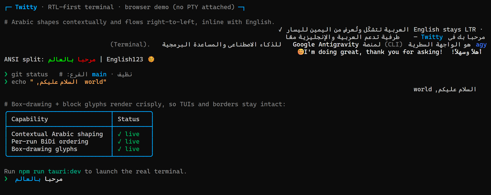
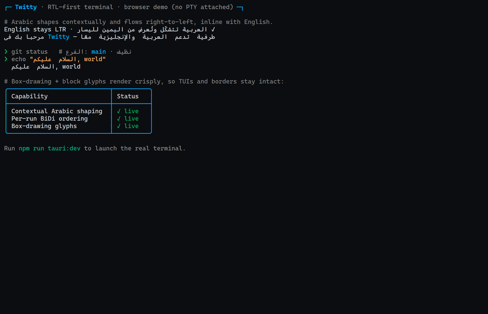
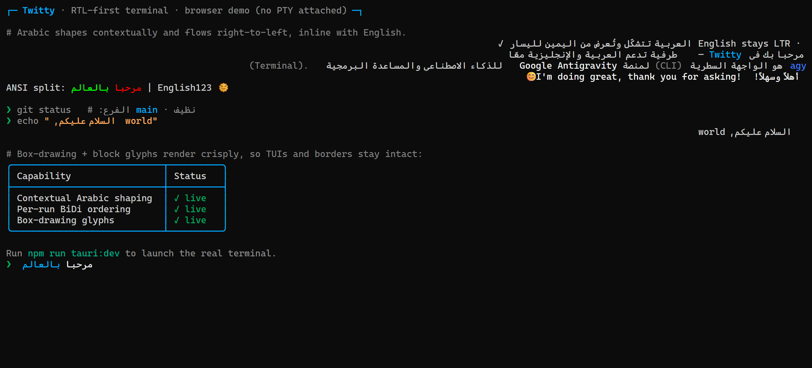

<div align="center">

# Twitty · RTL Terminal

**A bidirectional terminal emulator that renders Arabic the way it's meant to be read.**

Mixed Arabic/English text shapes contextually and flows right-to-left — inline and in real shells — with guarded PTY/session handling for stable day-to-day terminal use.

[](https://github.com/omarallsharkawy/RTL-Terminal/actions/workflows/build.yml)
&nbsp;·&nbsp; Tauri v2 &nbsp;·&nbsp; React 19 &nbsp;·&nbsp; xterm.js 6 &nbsp;·&nbsp; Rust



</div>

---

## Why Twitty

Most terminals treat Arabic as a stream of disconnected, left-to-right cells. Letters don't join, words read backwards, and anything bidirectional turns into noise. Twitty keeps the PTY stream unchanged and groups each visible Arabic phrase into a single xterm.js DOM render run. The browser then recalculates contextual shaping and right-to-left order from the complete current line after every character, while Latin text, numbers, ANSI styling, and box-drawing keep their normal terminal positions.

The app also hardens the PTY bridge around real terminal behavior: backend reads preserve split UTF-8 sequences, frontend listeners are cleaned up safely, ordered input batching prevents keystroke races across the async bridge, and session IDs prevent stale shell events from respawning or writing into the wrong terminal instance.

## Features

- **Contextual Arabic shaping** — full-line browser shaping updates correctly even when a shell echoes one character at a time.
- **Cross-style bidirectional ordering** — Arabic flows right-to-left even across adjacent ANSI-colored spans; English, digits, symbols, and TUI geometry stay left-to-right.
- **Protocol-safe rendering** — Unicode and ANSI/control sequences reach xterm unchanged; direction handling exists only in the DOM renderer.
- **Session-hardened PTY bridge** — split UTF-8 reads, stale shell events, and reconnect cleanup are handled defensively.
- **Ordered mixed-script input** — burst typing and paste are serialized per session, preserving Arabic, English, and control-key order exactly.
- **Fast native startup** — the Tauri bridge is bundled eagerly, shell listeners register in parallel, and Windows shell discovery avoids slow PATH scans.
- **Real shell, real PTY** — a genuine pseudo-terminal via Rust `portable-pty` (Windows ConPTY and Unix PTY).
- **Full ANSI support** — 24-bit color, alternate screen, scroll regions, mouse reporting, 10k-line scrollback.
- **Bundled Arabic font** — Noto Naskh Arabic ships with the app so joined Arabic glyphs render on every OS, including Linux.
- **F11 fullscreen**, native **Ctrl+C** interrupt, auto-resize, and shell auto-respawn on exit.
- **Terminal-only surface** — no internal title rail, shell selector, direction switch, status bar, or shortcut legend.
- **Browser demo mode** — open without a PTY to preview the rendering (the screenshots above are this mode).
- **Cross-platform builds** — Windows installer + Linux `.deb` / `.rpm` / AppImage from one GitHub Actions workflow.

## Screenshots

| Mixed Arabic + English, shaped and ordered | Crisp box-drawing for TUIs |
| --- | --- |
|  |  |

> The Arabic phrase `مرحبا بك في Twitty` reads right-to-left while `Twitty` stays left-to-right; the comma in `السلام عليكم, world` lands between the two scripts correctly.

## Quick start

### Browser demo (no shell)

```bash
npm install
npm run dev
```

Open the printed `localhost` URL. There's no PTY in the browser, so this shows a demo banner — useful for previewing the Arabic rendering.

### Desktop app (real shell)

Install [Rust](https://rustup.rs/) first, then:

```bash
npm install
npm run tauri:dev
```

On Windows the backend uses `TWITTY_SHELL` when set, then checks the standard PowerShell 7 and Windows PowerShell locations before falling back through PATH, `%COMSPEC%`, and `cmd.exe`. PowerShell starts with `-NoLogo -NoProfile`. On Unix it uses `$SHELL`, falling back to `/bin/zsh` on macOS and `/bin/bash` or `/bin/sh` elsewhere.

### Production build

```bash
npm run build         # type-check + bundle the frontend
npm run tauri:build   # produce native installers
```

## How the RTL rendering works

The hard part of an Arabic terminal isn't only shaping — it's shaping without changing terminal protocol data. Twitty incrementally decodes PTY UTF-8 so Arabic characters are not split at read boundaries, sends the original Unicode and ANSI stream into xterm, then joins Arabic phrases only at DOM-render time.

```
┌─────────────┐   raw bytes    ┌──────────────┐  unchanged UTF-8/ANSI  ┌─────────────────────┐
│  Real shell │ ─────────────▶ │  Rust PTY    │ ────────────────────▶ │ xterm.js buffer     │
│ (PTY/ConPTY)│                │  bridge      │ session-scoped events  │ terminal grid       │
└─────────────┘                └──────────────┘                         └──────────┬──────────┘
                                                                                  │ visible line
                                                                                  ▼
                                                                       ┌─────────────────────┐
                                                                       │ DOM character joiner│
                                                                       │ browser Arabic/BiDi │
                                                                       └─────────────────────┘
```

1. **The backend preserves UTF-8 boundaries.** PTY bytes are decoded incrementally, so Arabic characters split across read chunks are not replaced with `�`.
2. **Events are session-scoped.** `terminal://data` and `terminal://exited` include a session ID so stale killed shells cannot write to or respawn the current terminal.
3. **The xterm buffer stays canonical.** Shell input and output remain ordinary Unicode; the app never replaces Arabic with presentation-form characters.
4. **Arabic joins in the DOM renderer.** A character joiner groups each complete Arabic phrase so the browser shapes and orders the latest full line, including slow character-by-character echo.
5. **ANSI styles share one BiDi sequence.** Adjacent colored Arabic spans are not isolated from each other, so styling individual words does not reverse their sentence order.
6. **The terminal grid stays LTR.** Arabic direction is scoped to Arabic text runs so Latin commands and cursor cell positions remain predictable.

> **Note on `allowProposedApi`:** `registerCharacterJoiner` is a proposed API in xterm.js v6, so the terminal is constructed with `allowProposedApi: true`.

## Architecture

The Rust backend spawns a real shell inside a PTY and streams incrementally decoded output to the frontend as session-scoped `terminal://data` events. The frontend writes that stream unchanged into xterm.js, whose DOM character joiner handles visible Arabic phrases. Keystrokes enter a per-session queue that batches same-turn input and serializes every `write_terminal` call; window resizes via `resize_terminal`.

### Key files

| File | Responsibility |
| --- | --- |
| `src/components/XtermTerminal.tsx` | xterm.js setup, session-scoped PTY events, key handling |
| `src/components/arabicRenderer.ts` | Arabic phrase detection for xterm's DOM character joiner |
| `src/components/terminalInputQueue.ts` | Ordered, session-scoped terminal input batching |
| `src/App.tsx` | Terminal-only surface and contextual recovery notice |
| `src/styles.css` | Full-window terminal layout and bundled Arabic `@font-face` |
| `src-tauri/src/pty.rs` | PTY session lifecycle, incremental UTF-8 decoding, shell selection |
| `src-tauri/src/lib.rs` | Tauri commands: `start_terminal`, `write_terminal`, `interrupt_terminal`, `resize_terminal`, `stop_terminal` |
| `src-tauri/tauri.conf.json` | App + bundle config, CSP, window |
| `.github/workflows/build.yml` | Windows + Linux builds and GitHub release |

### Tech stack

- **Shell:** [Tauri v2](https://tauri.app/) (Rust core, system WebView).
- **Backend:** Rust with [`portable-pty`](https://crates.io/crates/portable-pty) for cross-platform PTY.
- **Frontend:** [React 19](https://react.dev/) + [Vite 6](https://vitejs.dev/) + [xterm.js 6](https://xtermjs.org/) with `@xterm/addon-fit`.
- **Font:** Noto Naskh Arabic (SIL OFL), subset to Arabic Unicode ranges.

## Platform support

| Platform | WebView engine | Status |
| --- | --- | --- |
| Windows | WebView2 (Chromium) | Primary target |
| Linux | webkit2gtk (WebKit) | Built via CI (`.deb` / `.rpm` / AppImage) |
| macOS | WebKit | Buildable from source |

## Development

```bash
npm run dev           # Vite dev server (browser demo)
npm run tauri:dev     # Tauri dev (real shell; PTY failure surfaces an inline retry notice)
npm run build         # tsc + vite build
npm test              # Arabic rendering + session/reconnect + ordered-input regression tests
node scripts/capture-shots.mjs   # regenerate docs screenshots
```

## Documentation

A full PDF write-up of the app and its design decisions lives at
[`docs/twitty-overview.pdf`](docs/twitty-overview.pdf).

## License

Twitty is distributed under the End User License Agreement in [`LICENSE.txt`](LICENSE.txt). The bundled Noto Naskh Arabic font is licensed separately under the SIL Open Font License.

## Notes

- The `kitty/` directory is vendored reference source, not part of the build, and is gitignored.
- Windows and Linux installers are built by GitHub Actions; GitHub releases are created only for version tags.
