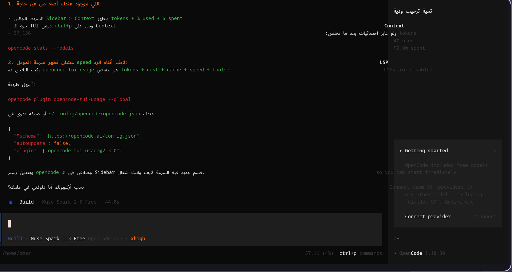
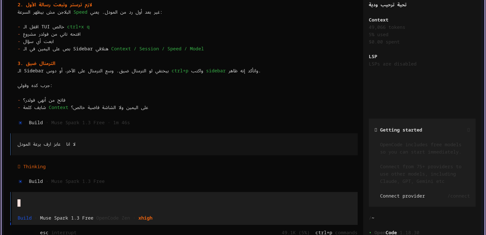

<div align="center">


# Twitty · Native RTL Terminal

**A high-performance, GPU-accelerated terminal emulator engineered for bidirectional Arabic text.**

Mixed Arabic, English, numbers, and terminal control sequences render contextually and flow seamlessly right-to-left — in real shells and complex TUIs — backed by a pure-Rust engine with hardware-accelerated WGPU rendering.

[](https://github.com/omarallsharkawy/RTL-Terminal/actions/workflows/build.yml)
&nbsp;·&nbsp; Rust 1.85+ &nbsp;·&nbsp; WGPU 30 &nbsp;·&nbsp; Cosmic-Text &nbsp;·&nbsp; Linux (Wayland/X11) &nbsp;·&nbsp; Windows (ConPTY)


</div>

---

## Why Twitty v2

Most terminal emulators treat screen memory as a rigid grid of isolated left-to-right cells. Arabic letters appear broken, words read backwards, and complex interactive terminal applications (such as OpenCode, Neovim, and Htop) suffer column displacement when Arabic is displayed.

Twitty v2 completely discards web wrappers and DOM-based terminal libraries. Built from the ground up in native Rust, it integrates **Cosmic-Text** and pure-Rust **HarfBuzz** shaping with **WGPU** GPU rendering, delivering 120 FPS frame rates, instant input latency, and pixel-perfect bidirectional text.

## Features

- **Contextual Arabic font shaping** — Arabic letters join naturally (initial, medial, final, isolated forms) across shell echo and interactive CLI applications.
- **Scoped RTL paragraph segmentation** — Arabic text flows right-to-left within its assigned visual container without displacing adjacent columns, sidebars, or table borders.
- **Inverted-prompt prevention** — Shell prompt symbols (such as `~ ❯`) maintain an LTR paragraph base and stay fixed on the left, never inverting when followed by Arabic input.
- **Zero-gap geometric rendering** — Box-drawing lines and block characters (`█`, `▀`, `▄`, `│`, `─`) are rasterized directly as geometric GPU primitives, eliminating font-margin seams.
- **Full mouse integration** — SGR mouse reporting (`1000`, `1002`, `1006`), mouse-wheel scrolling inside TUIs, middle-click paste, and `Ctrl + MouseWheel` zoom.
- **Hardware-accelerated GPU pipeline** — Rendered through WGPU 30 (Vulkan on Linux, Direct3D 12 on Windows) using low-latency Mailbox presentation.
- **Row-level differential caching** — Unchanged terminal rows bypass font shaping entirely, reducing CPU load to near zero during high-throughput text streaming.
- **Background opacity and Wayland blur** — Configurable alpha compositing for native transparency and compositor-assisted background blur on Hyprland, Sway, and KWin.
- **Physical key mapping** — Core terminal controls (`Ctrl+C`, `Ctrl+D`, `Ctrl+L`) remain functional regardless of active keyboard layout (Arabic, English, French).
- **Persistent configuration** — Automatic saving of font size, background opacity, and cursor styles to `~/.config/twitty/config.json`.
- **System desktop integration** — Bundled `twitty.desktop` launcher and scalable vector icons for Linux application menus (Rofi, Wofi).

## Screenshots

| Mixed Arabic & English in TUI | Full Interactive Session |
| --- | --- |
|  |  |

---

## Quick Start

### Prerequisites

Install [Rust 1.85 or newer](https://rustup.rs/) (available via `rustup` or your distribution package manager).

### Running in Development

```bash
git clone https://github.com/omarallsharkawy/RTL-Terminal.git
cd RTL-Terminal
cargo run
```

### Production Release Build

```bash
cargo build --release
```

The optimized binary is produced at:
- **Linux:** `target/release/twitty`
- **Windows:** `target/release/twitty.exe`

To install the desktop launcher and icon on Linux:
```bash
cp branding/twitty-mark.svg ~/.local/share/icons/hicolor/scalable/apps/twitty.svg
cp branding/twitty.desktop ~/.local/share/applications/
update-desktop-database ~/.local/share/applications/
```

---

## Architecture

Twitty's architecture decouples PTY execution from text layout and GPU rendering:

```
┌──────────────┐     raw bytes      ┌─────────────────────────┐     snapshots     ┌────────────────────────┐
│  Real Shell  │ ─────────────────> │   alacritty_terminal    │ ────────────────> │   Twitty Render Loop   │
│ (Unix/ConPTY)│                    │  VT Parser & Grid State │                   │  Row Cache + Scoped RTL│
└──────────────┘                    └─────────────────────────┘                   └───────────┬────────────┘
       ▲                                         │                                            │
       │                                         │ queries                                    ▼
       │               PtyWrite responses        │                             ┌────────────────────────┐
       └─────────────────────────────────────────┘                             │      WGPU 30 + Glyphon │
                                                                               │ Vulkan / D3D12 Surface │
                                                                               └────────────────────────┘
```

### Core Components

| Module | Responsibility |
| :--- | :--- |
| `src/main.rs` | Event loop entrypoint, logger initialization, and runtime dispatch |
| `src/app.rs` | Application handler (`winit`), window events, mouse dispatch, PTY bridge |
| `src/renderer.rs` | WGPU surface management, row differential caching, text segmenting |
| `src/terminal.rs` | VT state machine wrapper, grid snapshotting, RTL character detection |
| `src/pty.rs` | Cross-platform PTY abstraction (`portable-pty`), shell discovery |
| `src/quad.rs` | Geometric primitive renderer for box-drawing, block elements, and cursor |
| `src/input.rs` | Physical keycode mapping, shortcut translation, SGR mouse encoding |
| `src/color.rs` | Tokyo Night inspired 24-bit TrueColor palette, ANSI color resolution |
| `src/config.rs` | Persistent configuration manager (`~/.config/twitty/config.json`) |

---

## Configuration

Twitty reads configuration from `~/.config/twitty/config.json` (on Linux) or `%APPDATA%	witty\config.json` (on Windows):

```json
{
  "font_size": 14.5,
  "background_opacity": 0.92,
  "cursor_style": "beam"
}
```

### Configuration Options

| Option | Type | Default | Description |
| :--- | :--- | :--- | :--- |
| `font_size` | `float` | `14.5` | Terminal font size in points (range: 8.0 - 48.0) |
| `background_opacity` | `float` | `0.92` | Window background opacity (range: 0.1 - 1.0) |
| `cursor_style` | `string` | `"beam"` | Cursor geometry: `"beam"` (2px vertical), `"underline"`, or `"block"` |

---

## Keyboard and Mouse Shortcuts

| Shortcut | Action |
| :--- | :--- |
| `Ctrl + =` / `Ctrl + +` | Increase font size (Zoom In) |
| `Ctrl + -` | Decrease font size (Zoom Out) |
| `Ctrl + 0` | Reset font size to default (14.5 pt) |
| `Ctrl + MouseWheel` | Interactive zoom in and zoom out |
| `Ctrl + Shift + V` / `Middle Click` | Paste text from system clipboard |
| `Ctrl + C` | Send SIGINT / Interrupt active command |
| `MouseWheel` | Scroll inside TUI (Vim, OpenCode) or view scrollback |

---

## License

Twitty is licensed under the MIT License. See [LICENSE.txt](LICENSE.txt) for details.
