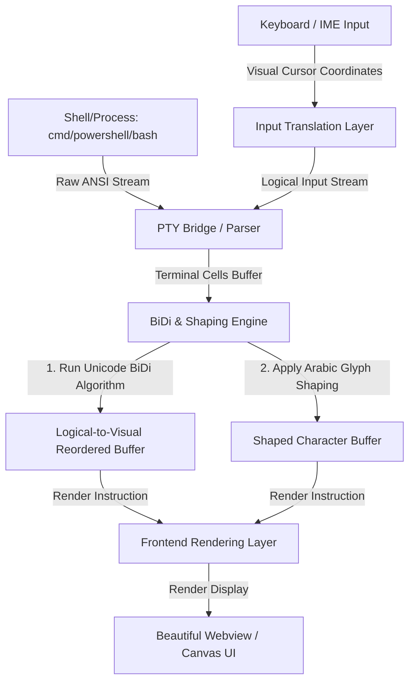

# Comprehensive AI Prompt: Building an RTL-First Bidirectional Terminal Emulator

Below is the detailed prompt you can copy-paste and feed into **ChatGPT 5** (or any advanced LLM). It outlines the vision, requirements, technical architecture, and implementation steps, while giving the AI the creative freedom to enhance and optimize the design.

---

```markdown
# System Specification & Code Generation Request: RTL-First Bidirectional Terminal Emulator (Windows-focused, Cross-Platform Ready)

## Objective
Build a complete, production-grade, highly aesthetic desktop terminal emulator application that natively supports Right-to-Left (RTL) text flows as its primary mode, while seamlessly rendering mixed Left-to-Right (LTR) English text, numbers, and code. The application should target Windows (using ConPTY) but keep cross-platform compatibility in mind for future Linux/macOS support.

The ultimate goal is to solve the classic terminal rendering issue where Arabic characters are printed disconnected, reversed, or misaligned, especially when combined with LTR text (like file paths, git commands, or code snippets).

---

## 1. Technical Stack Options
*You are free to refine or propose improvements to this stack, but here is the recommended blueprint:*
* **Backend/Core (Performance & OS Hooking):** Rust
  * *Rationale:* Rust provides low-latency process management, safe memory usage, and access to excellent text shaping libraries (like `cosmic-text` or `harfbuzz-rs`) and windows API bindings (`windows-sys`).
* **Frontend/UI (Visual Layout & Customization):** Tauri (v2) with TypeScript + React or SolidJS + TailwindCSS / Custom CSS.
  * *Rationale:* Tauri keeps the binary footprint tiny and memory usage low, while allowing modern, stunning UI designs (acrylic/blur effects, dark mode, animation) via standard web technologies.
* **PTY Bridge:** `portable-pty` crate (or similar) to interface with Windows ConPTY (`conpty`) and standard Unix PTY on Linux.
* **BiDi & Shaping Layer:** `unicode-bidi` for the reordering algorithm (UAX #9) and `unicode-arabic` or a shaping engine (like HarfBuzz/Cosmic-Text) to handle Arabic joining states (Isolated, Initial, Medial, Final).

---

## 2. Core Architecture & Data Flow



### Architectural Subsystems:
1. **PTY Layer (Shell Interface):** Spawns a pseudo-terminal on the host OS (e.g., executing `powershell.exe` on Windows). Intercepts input/output streams and processes VT/ANSI escape sequences (colors, cursor movements, screen clearing).
2. **Grid Buffer Layer:** Maintains a 2D matrix of terminal character cells. Each cell contains the character, styling (color, intensity, underline), and its logical buffer index.
3. **BiDi & Shaping Layer (The Core Engine):**
   * **Reordering:** Scans the text line-by-line, detects text directionality, and applies the Unicode Bidirectional Algorithm (UAX #9) to map logical character indices to visual display columns.
   * **Shaping:** Maps Arabic letters to their contextual glyph representations (Initial, Medial, Final, or Isolated) before visual rendering.
   * **Mixed Flow Handling:** Ensures that LTR strings (like Unix paths, command-line arguments, or code snippets) within an RTL context retain their proper LTR readability and ordering.
4. **Input & Cursor Controller:** Translates visual cursor actions (mouse clicks, selection sweeps, arrow-key navigation) back into logical buffer offsets, ensuring standard shell behavior is preserved. Supports active IME (Input Method Editors) for RTL languages.
5. **UI Layer:** A beautiful, responsive, modern desktop frame featuring:
   * Tabbed interface with smooth transitions.
   * Blur-behind glassmorphism (Acrylic styling on Windows, Vibrancy on macOS).
   * Customized typography using high-quality monospace fonts (e.g., "Cairo", "Vazirmatn", or "JetBrains Mono").

---

## 3. Detailed Requirements & Design Patterns

### A. Bidirectional Rendering Logic (Crucial)
* **Line-by-Line BiDi:** The terminal must dynamically analyze the content of each line to determine the base direction (RTL if Arabic characters dominate, or explicitly set by terminal configuration).
* **Mixed Line Flow:** If a line contains `cd /var/www/ar_project`, the text `cd /var/www/` is LTR and the folder name may be Arabic (RTL). The segment boundaries must be calculated accurately.
* **Monospace Alignment:** In grid-based terminals, Arabic glyphs can vary in width. The renderer must align shaped characters precisely to grid columns to prevent overlapping or text gaps.

### B. Shell & PTY Interaction
* Handle standard Windows console features using ConPTY (Windows Pseudo Console API).
* Parse ANSI escape sequences (e.g., `\x1b[31m` for red text, `\x1b[H` to home cursor) correctly, ensuring that visual reordering does not break styling boundaries.

### C. Visual Identity & Aesthetics (Wow-Factor)
* **Glassmorphism:** Elegant, customizable transparency with a backdrop-blur.
* **Dynamic Themes:** Clean dark-mode palette by default (with HSL-tailored accents like deep violet, emerald green, and neon cyans).
* **Micro-interactions:** Smooth cursor blinking animation, tab-loading indicators, and interactive scrollbar effects.

---

## 4. Implementation Steps
You are expected to generate the code files for the core modules:

1. **Phase 1: Backend Setup (Tauri + Rust)**
   * Create the Tauri configuration file (`tauri.conf.json`) enabling window transparency and decorations.
   * Set up the Rust backend dependencies: `portable-pty`, `unicode-bidi`, and `tauri`.
2. **Phase 2: The PTY & ANSI Parser**
   * Write the Rust controller to spawn the shell process and pipe read/write buffers.
   * Build a lightweight ANSI parser that decodes escape commands while keeping track of logical buffer states.
3. **Phase 3: The BiDi Rendering Engine**
   * Implement a Rust-based helper that accepts a logical string, applies Unicode BiDi reordering, shapes the Arabic glyphs, and returns a JSON payload of visual characters with layout mapping.
4. **Phase 4: Frontend UI (Tauri / React)**
   * Build the terminal grid component using HTML5 Canvas or WebGL (or highly optimized DOM nodes) to ensure low-latency rendering.
   * Write styling rules (`index.css`) for a modern glassmorphic look with custom fonts.
   * Implement custom terminal controls (multiple tabs, settings modal).

---

## 5. Architectural Freedom & Enhancements
If you find a more performant, cleaner, or robust way to implement any part of this system, **you are encouraged to do so**. For example:
* If you prefer building a native Rust GUI using `wgpu` and `cosmic-text` directly (without Tauri/Webview) to maximize rendering speed and native appearance, feel free to write the implementation in that paradigm.
* If you have optimizations for logical-to-visual cursor conversion, implement them.
* Provide clean, documented code, clear file structures, and a walkthrough of how to build and run the code.

Let's begin! Create a fully functional, end-to-end codebase for this application.
```
